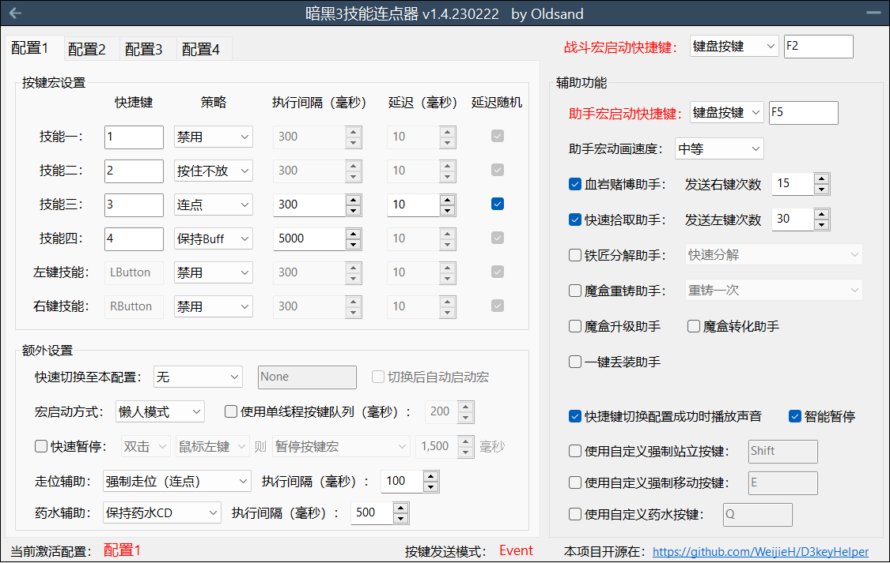
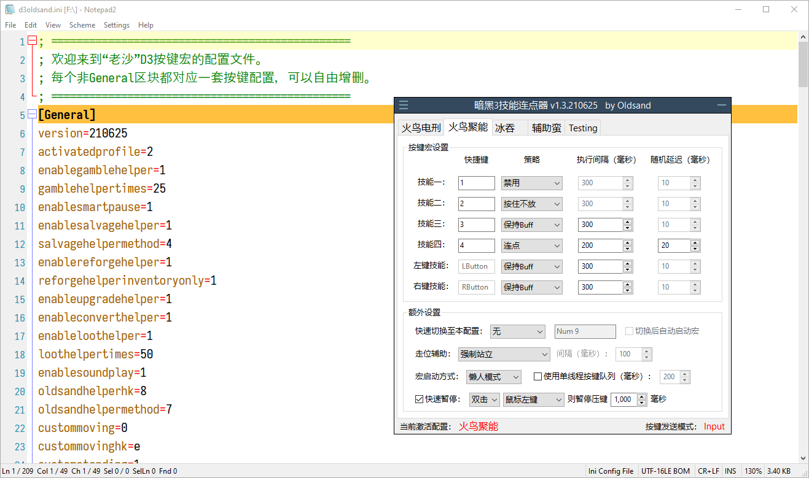

# D3keyHelper
D3KeyHelper是一个有图形界面，可自定义配置的暗黑3自动宏工具。

运行代码请使用最新版的AHK软件，所有测试在v1.1.33.06版本下运行通过。

## 主界面

1. 设置宏总启动快捷键。因为暗黑3的默认强制站立键为左Shift，玩家在设置所有宏相关快捷键时应避免使用Shift键，以免出现bug！
2. 对应游戏1234技能快捷键，除了鼠标左右键无法更改外其他都可以自定义。
3. 设置对应按键的执行策略，目前支持的可能策略有：
   1. 按住该键不放（按住不放）。
   2. 固定时间间隔点击（连点）。
   3. 保持Buff模式（保持buff）。保持buff只能针对有绿条buff的技能，比如法师电盾，DH烟雾弹。宏会自动检测相关像素点的颜色信息，在buff快消失时点击续上buff。该功能只在1920x1080，2560x1440，3440x1440分辨率下测试过。其他分辨率下的像素位置会根据最接近的已知分辨率推算，但不能保证正常工作。
4. 这里设置具体各个策略的执行间隔，最少20毫秒，最多30秒运行一次。
5. 这里有一些和本策略有关的额外设置：
   1. 快速切换：设置一个按键快速切换到本配置，软件默认使用第一个配置。绑定并按下切换快捷键是唯一的切换配置方法。点击界面7处的选项卡不会切换配置。
   2. 走位辅助：可设置为强制站立（按住左Shift键），或者强制走位（根据间隔按下e键）。
   3. 宏启动方式：懒人模式（按一下开，再按一下关）。仅按住时（字面意思）。
6. 这里设置其他的辅助功能：
   1. 赌博助手：按下快捷键时即按下x次右键。
   2. 智能暂停：按下tab键时暂停宏，按下回车，回城（T），地图（M），技能（S）时停止宏。
7. 这里可以设置并保存多套配置。
s
## 配置文件

软件在打开时会自动载入同目录下的d3oldsand.ini配置文件。若无该配置文件，软件会套用默认设置并在下一次关闭，退出时创建该配置文件。

配置文件可以用任意文本编辑器打开并修改，比如修改配置名字。增加，或者减少配置。配置文件可以分享给其他玩家。