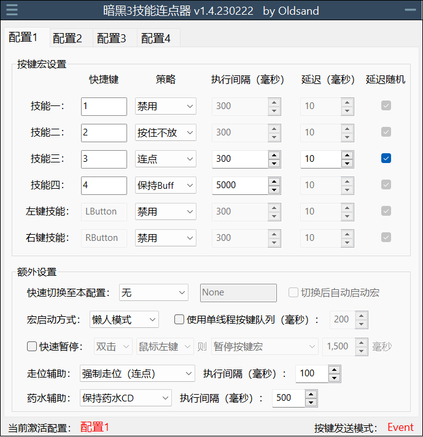

# D3keyHelper

D3KeyHelper是一个有图形界面，可自定义配置的暗黑3鼠标宏工具。

运行代码请使用最新版的AHK软件，所有测试在v1.1.33.09版本下运行通过。

## 主界面（完全模式）

## 主界面（紧凑模式）

1. 右上角设置战斗宏启动快捷键。可以为鼠标或者键盘按键。因为暗黑3的默认强制站立键为Shift，玩家在设置所有宏相关快捷键时应避免使用Shift键，以免出现bug！
2. 按键宏设置区域可以设置具体的战斗宏：
   1. 设置对应的技能快捷键，和游戏中一样除了鼠标左右键无法更改外其他都可以自定义。
   2. 设置对应按键的执行策略，目前支持的可能策略有：
      1. 按住该键不放（按住不放）。
      2. 固定时间间隔点击（连点）。
      3. 保持Buff模式（保持buff）。保持buff只能针对有绿条buff的技能，比如法师电盾，DH烟雾弹。宏会自动检测游戏分辨率并获取相关像素点的颜色信息，平时并不作为，只在buff快消失时点击续上buff。
   3. 设置具体各个策略的执行间隔，最少20毫秒，最多60秒运行一次。
   4. **1.4版本对延迟功能进行了重新设计，支持正负延迟，从而适配类似武僧火元灵，需要卡元素戒周期，且爆发有前戏的Build。**
3. 额外设置区域包含一些和可以继续提升游戏体验的辅助功能：
   1. 快速切换：设置一个按键快速切换到本配置。
      1. 切换后自动启动宏（开启后，以懒人模式启动的宏可以在运行过程中无缝切换）
   2. 走位辅助：可设置为强制站立，或者强制走位。
   3. 宏启动方式：
      1. 懒人模式（按一下开，再按一下关）。
      2. 仅按住时（字面意思）。
      3. 仅按一次（按下时自动按下所有“按住不放”的技能按键一次）。
   4. 使用单线程按键队列：开启后，因连点，保持buff所产生的按键不会立即按下，而是加入到一个按键队列中。连点会使得按键加入队列的头部，保持buff会加入队列的尾部。最后按键队列里的按键再按照固定的时间间隔一一发送至游戏。此功能主要配合冰吞使用，可以解决冰吞因为前后摇无法续上buff的问题。但是开启后会造成而外的按键延迟，非冰吞请勿开启。
   5. 快速暂停：按下对应鼠标键时可以短时间暂停压键。因为游戏本身设计中当有按键长按时会屏蔽鼠标左键。开启这项功能可以缓解无法点门，无法点祭坛的情况。
4. 右侧设置通用的辅助功能：
   1. 设置助手快捷键。程序会自动猜测用户的目的从而执行对应的策略。同时助手宏的启动方式和战斗宏的懒人模式类似，按一下开启，再按一下可以打断当前宏。
   2. 助手宏动画速度：可以调节鼠标移速，等待间隔。根据自身网络，电脑情况选择。
   3. 赌博助手（出现赌博界面时开启）：按下助手快捷键时即按下x次右键。
   4. 拾取助手（非战斗中，其他助手都没唤醒时开启）：若鼠标在人物附近，按下助手快捷键即按下x次左键，否则只按下一次左键。
   5. 分解助手（出现分解页面时开启）:
      1. 快速分解，按下即等于左键点击+自动回车。
      2. 一键分解，按下自动分解背包内所有能分解，不处在安全格中的物品。灰白蓝黄不受安全区域影响，无论如何都会被分解掉。
      3. 智能分解，和一键分解一样，但会跳过远古，无形，太古。另有两个模式可以只留无形，太古。或者只留太古。
   6. 重铸助手（重铸页面打开时开启）：
      1. 重铸一次：重铸鼠标指针处的装备一次。
      2. 重铸直到远古，太古：不停重铸直到装备变为远古或者太古
      3. 不停重铸的最大重铸次数可以通过配置文件修改
   7. 升级助手（升级页面打开时开启）：自动升级背包内不在安全格区域内的黄色装备。
   8. 转化助手（转化页面打开时开启）：自动使用背包内非安全格内的装备转化材料。
   9.  使用快捷键切换配置成功时播放声音（字面意思）。
   10. 智能暂停：按下tab键时暂停宏，按下回车，回城（T），地图（M）时停止宏。

## 配置文件

软件在打开时会自动载入同目录下的d3oldsand.ini配置文件。若无该配置文件，软件会套用默认设置并在下一次关闭，退出时创建该配置文件。
配置文件可以用任意文本编辑器打开并修改，开头的General区块存放和程序本身相关的一些配置。可以自行在此配置和一键宏相关的安全区域（safezone）
### * 配置安全格
safezone中的格子不会受到一键宏的影响。配置格式为英文逗号分隔的格子编号。具体编号与游戏背包格子的对应如下：

序列号默认为61，62，63。这三个格子并不存在只是为了提示设置的格式。

序列号的排序无所谓，关闭/退出后它们会被自动从小到大排序。

选择一键/智能分解，安全区域设置完成并且包含至少一个1-60的格子时，你可以在动画速度下拉菜单的后面看到一个绿色的字符提示。
### * 一些其他的配置选项说明
d3only：默认为1，即鼠标键盘按键只针对暗黑三游戏窗口启用。修改为0后程序标题会改变且按键对任意窗口启用，此时你可以把本程序用在其他游戏的按键连点上。

gamegamma：如果你使用了自定义游戏gamma，去 我的文档->Diablo III -> D3Prefs.txt 把里面的Gamma值不带引号复制到这里。该值默认为1.000000

buffpercent：默认为0.05，即保持buff在buff还剩最后5%时会点击续上buff，可以根据需要修改，范围0-1。

runonstart：默认为1。即各策略会在宏开启的瞬间执行一次。当设置为0时策略会等到“执行间隔”时间到后才开始执行。

gameresolution：默认为Auto，宏会尝试通过Windows API自动获取当前游戏分辨率。你也可以强制设定游戏分辨率，格式为窗口宽x窗口高，分割符为英文小写字母x，比如1920x1080

helperanimationdelay：默认为150，自定义动画的等待速度。“非常快”预设时此值为50。

helpermousespeed：默认为2。自定义动画的鼠标移动速度。“非常快”预设时此值为0。注意鼠标移速对Input模式不起作用。

随后的各个区块都对应具体的配置。因此可以通过重命名。增加，或者减少区块来控制软件中配置的显示。

配置文件可以分享给其他玩家。
